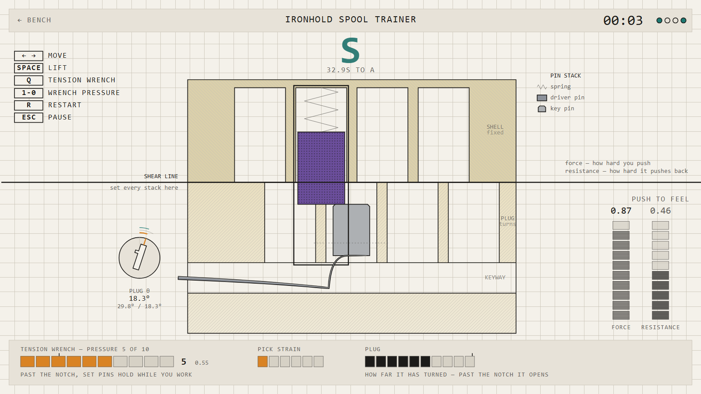

# SHEAR LINE

**A lockpicking simulator that does not roll dice. → [lockpick.fun](https://lockpick.fun)**



Every lock in this game is a real mechanism, simulated. There is no hidden success chance, no
progress bar, no timing minigame. When a pin sets it is because you held the pick still inside a
window a fraction of a millimetre wide for long enough that the plug's ledge got under the driver —
and when a spool shoves your pick back out, that is a wedge on a bevel, computed.

Twenty-two pin tumblers across four tiers, and a pick that bends when the lock pushes back.

---

## Playing

It runs in the browser at **[lockpick.fun](https://lockpick.fun)** — nothing to install, no account,
no network traffic once the page has loaded.

Or take it with you: every build is attached to the
[latest release](../../releases/latest) as a zip. Unpack it, open `index.html`, and it runs off the
disk with no server — there is nothing in it to fetch.

Or run it from source:

```
npm install
npm run play        # opens http://localhost:5173
```

A built copy also opens straight off disk: `npm run build`, then double-click `dist/index.html`.
Everything you will see and hear is generated in code — there is not a single image or sound file
in this repository.

### The two hands

You pick with the keyboard. The mouse operates the menus.

| | |
|---|---|
| **Q**, held | The tension wrench. **Nothing in the game works without it.** |
| **← / →** | Move the pick one chamber along the keyway, dropping it as it goes. |
| **Space**, held | Push the pick up. Let go and the pin rides its spring back down. |
| **1 … 9, 0** | Wrench pressure, ten steps. |
| **↑ / ↓** | Trim the lift a hair. Training level only — everywhere else, Space is the hand. |
| **R** | Restart this lock with a fresh tolerance seed. |
| **Esc** | Pause. |

The wrench is the one to learn first. With no tension nothing binds and nothing can be captured, so
you can lift every pin in the lock and achieve exactly nothing — the game says so, in amber, until
you have used it once.

On a phone: turn it sideways, tap a pin to select it, drag up to lift, and the slider down the left
edge *is* the wrench — off at the bottom, ten pressure steps above.

### Where to start

Three lessons sit at the top of the bench. They take about five minutes between them and they are
the whole game in miniature: find the binding pin, jam one on purpose and learn what a reset costs,
then meet a spool and learn that a lock can lie to you. Nothing in them is a wall of text you click
past — one line at a time, and it changes when you do something.

### If it feels impossible

It might be the lock. It might also be the wrench. Four levels are in Settings, switchable at any
time, and each takes away exactly one channel:

- **Training** — the binding pin is bracketed, the capture window is marked, the overset zone is
  shaded red before you get there, and the arrow keys will trim your lift for you.
- **Easy** — the readouts and a progress dot per pin. The default.
- **Medium** — no pin dots. The meters and the pick's flex.
- **Hard** — no cutaway at all. The lock's face, your hands, and what you can hear.

**The level buys time, not points.** There is no currency in this game; the only score is the rank
on the clock, and the level scales the par you are ranked against — 0.6x on Training up to 2.5x on
Hard. The same attempt is a C on Easy and an S on Hard, so picking blind is rewarded rather than
merely respected. Nothing is locked behind difficulty.

Turn on audio subtitles in Settings if you would rather read the lock than hear it.

---

## What is actually being simulated

Every driver pin is a **stack of bands** along its length, each one full diameter or reduced. The
simulation asks one question a hundred and twenty times a second — *what is at the shear line?* —
and spools, serrated pins, mushrooms and T-pins all fall out of the answer. There is no
`if (pinType === 'spool')` anywhere in `src/sim/`.

The whole simulation is **pure**: no DOM, no canvas, no clock, no `Math.random`. It runs at a fixed
1/120s tick against a seeded PRNG, so the same seed and the same inputs produce a byte-identical
result forever. A lint rule enforces the purity and a test proves the lint rule works. That is what
makes the solver possible, and the solver is what proves every lock in the game can be opened.

### A note on the `D-nnn` references

Comments throughout the source cite decisions by number — *"see DECISIONS D-105"*. They point into
a design log that is not published with the code. The numbers are kept because the reasoning behind
a line is worth naming even when the write-up is not in the tree: a comment saying which decision a
piece of code came from is more use than one that says nothing, and the surrounding comment always
states the reasoning itself.

The short version of the ones that matter most: the specification this was built from was wrong in
six places that would each have sunk it. The torque model made every lock unopenable below
T = 0.98. Every pin profile put its grooves above the reachable band, so no security pin could ever
have lied. Raking as random impulses cannot work, because a kicked pin falls back faster than the
capture time and so never dwells. Each was found by building the thing and measuring it.

---

## For developers

```
npm run play        # dev server
npm run verify      # typecheck + lint + unit tests + browser tests + perf. The gate.
npm run test        # unit tests with coverage
npm run e2e         # Playwright only
npm run perf        # the frame-time histogram, alone on the machine
npm run shots       # regenerate screenshots/
npm run build       # production bundle into dist/
```

`npm run verify` is the only thing that matters. It runs 649 unit tests and 103 browser tests,
including a scripted solver that opens every lock across 50 random seeds each, a full playthrough
from an empty save, a WCAG AA contrast check, a greyscale check that every pin state survives
colour removal, and a frame-time histogram.

### Layout

```
src/sim/      the simulation. Pure. No platform imports, enforced by lint.
src/game/     roster, ranks, progression, achievements, tutorial, editor.
src/render/   Canvas2D drawing. Reads sim state, never writes it.
src/audio/    Web Audio synthesis. No samples.
src/ui/       screens, widgets, input.
docs/         the specification this was built from.
```

Events are the only channel from the simulation to audio and effects. The renderer may read state;
it must never mutate it.

---

## Things worth knowing

- **The roster is smaller than the spec, on purpose, twice.** `docs/CONTENT.md` describes 36 locks
  across six families. The shipped game is 22 pin tumblers across four tiers: D-088 cut the shop,
  the tool loadout and four families, and D-104 cut the disc detainers because the game never
  taught them. Everything cut is recorded in `DECISIONS.md` with the reasoning, and every family is
  still modelled and still tested from fixtures — the roster shrank, the simulation did not.
- **There is a lock editor.** Build one, and share it as a short code.
- **Saves are versioned** and migrate forward. Export and import are in Settings.
- **`dist/` is portable.** It runs from a static server and from `file://`, which is why the bundle
  is a classic script rather than an ES module (`DECISIONS.md` D-037).
- Nothing here talks to a network, and there is no analytics, no account and no telemetry.

All brand names in the game are invented.
