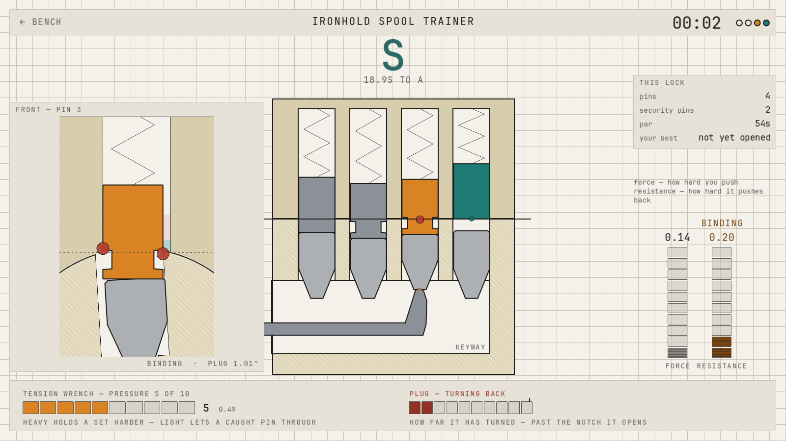
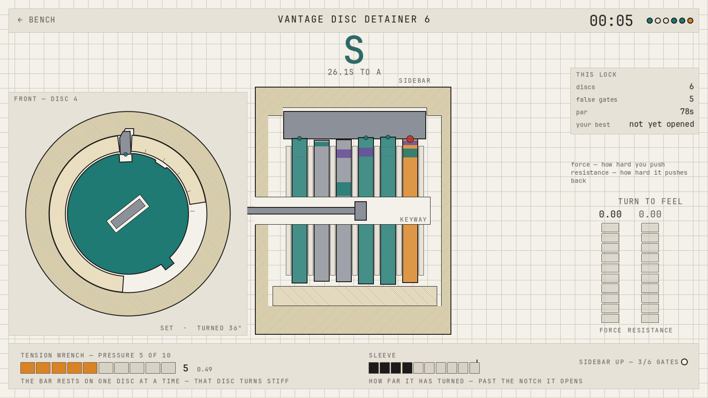

# SHEAR LINE

A lockpicking simulator. Play it in the browser at **[lockpick.fun](https://lockpick.fun)**.



In most games lockpicking is a minigame with a dice roll behind it. Here the lock itself is
simulated: pins, springs, a plug and a tension wrench. A pin sets when you lift it to the shear line
while the plug is binding it. A spool gives you a false set. Push a pin too far and it oversets.
There is no success chance anywhere.

## What's in it

- 27 locks: 21 pin tumblers (the harder ones have spools, serrated pins, mushrooms and T-pins),
  3 combination locks and 3 disc detainers
- a tutorial of 10 short lessons
- Lock Blitz: 5 minutes, open as many locks as you can
- a snap gun that works on 6 of the plain locks
- a lock editor, with codes for sharing a lock you built
- trophies, two themes, and a help section with pictures



There are two levels. Training colours the pins and shows which one is binding. Normal shows the
same lock without the hints. Each lock gives you a rank for your time.

## Controls

On the keyboard:

| key | |
|---|---|
| Q (hold) | tension wrench |
| ← → | move the pick |
| Space (hold) | lift the pin, or turn the disc |
| 1 to 0 | wrench pressure |
| C (hold) | ease the plug back |
| R | restart |
| Esc | pause |

Hold the wrench first. Without tension nothing binds and nothing sets.

Mouse, controller and touch work too, see [src/README.md](src/README.md#controls).

## Feedback

There is a Feedback button in the game. You can also
[open an issue](https://github.com/zzzteph/lockpick.fun/issues/new) or come to the
[Discord](https://discord.gg/V9ce457mup).

## The repository

- `src/` is the game, a Godot 4.7 project. Details are in [src/README.md](src/README.md).
- `old/` is the first version, written in TypeScript. It is not developed anymore but still runs
  at [lockpick.fun/classic](https://lockpick.fun/classic/). See [old/README.md](old/README.md).
- `.github/workflows/deploy.yml` runs the tests and publishes the site on every push to `main`.

To run from source you need Godot 4.7.2:

```
godot --headless --path src --import    # once, after cloning
godot --path src
```

## Licence

MIT, see [LICENSE](LICENSE).
