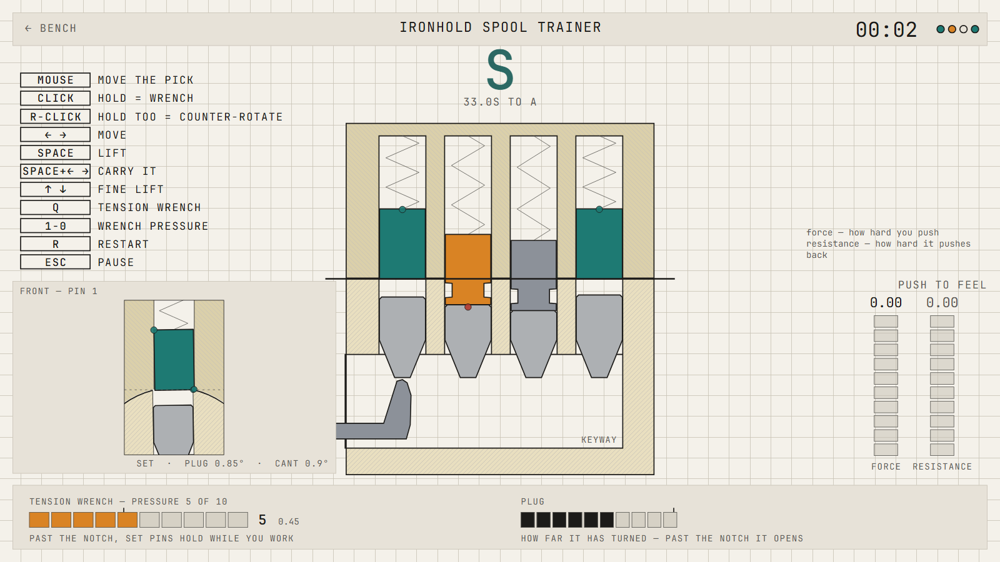

# SHEAR LINE, the first version

This is the original browser version of the game, written in TypeScript. It is not developed
anymore. The current game is the Godot project in [`../src`](../src/README.md), and that is what
[lockpick.fun](https://lockpick.fun) serves.

This version is still playable at **[lockpick.fun/classic](https://lockpick.fun/classic/)**.

It has 24 locks in four tiers (pin tumblers and combination wheels), a snap gun, a lock editor and
a dungeon of locked doors.

## Playing

It runs in the browser. Nothing to install, no account, and no network requests after the page has
loaded.

For an offline copy, every build is attached to the [latest release](../../../releases/latest) as
a zip. Unpack it and open `index.html`.

### Controls

Keyboard, mouse or controller. The pick screen shows the controls for whatever you are using.

| key | |
|---|---|
| Q (hold) | tension wrench |
| Left / Right | move the pick |
| Space (hold) | push the pick up; let go and the pin drops |
| 1 to 0 | wrench pressure |
| Up / Down | fine lift (Training only) |
| R | restart |
| Esc | pause |

Hold the wrench first. Without tension nothing binds and nothing sets.

With the mouse: move it to move the pick, hold the left button for the wrench, and hold the right
button as well to ease the plug back.

On a phone, turn it sideways. Tap a pin to select it and drag up to lift. The slider on the left
edge is the wrench.

### Where to start

The Tutorial has eight short lessons: the turn, tension and lift, overset and reset, wrench
pressure, the spool, the serrated pin, the wheel pack and the snap gun.

### Levels

There are two, in Settings:

- Training shows everything: pin types, the binding pin, the target window.
- Normal shows the pins without state colours or hints.

There is no currency. The score is your rank on the clock. Training is ranked against 0.6x of a
lock's par time, Normal against the full par. Audio subtitles can be turned on in Settings.

## Bugs and questions

[Open an issue](https://github.com/zzzteph/lockpick.fun/issues/new), or ask on the
[Discord](https://discord.gg/V9ce457mup). The game also has a "report an issue" button that fills
in which screen and lock you were on.
